# OfferOS 🎯

    

> 拿 offer 的操作系统——一个 **「你 + Claude」协作**、端到端管理整场求职的系统：**计划 → 准备 → 投递 / 内推 → 面试 → 谈判 → 复盘**。

**和"求职 Notion 模板""Excel 追踪表"不一样的地方**：它把 **Claude 编进了工作流**——不只是记录进度，而是真帮你出题、改简历、设计/解读 A/B 实验、抓 JD 与情报、整理面经、阶段复盘。**自带能跑的题库**（5 角色约 150 题、每题带解法）、**联网情报**、**手机可装成 App**、**中英双语**——开箱即用，不是空壳。

仓库里的 **markdown 文件就是数据库**；仓库根同时是一个 **Next.js 站点**，把这些 markdown 渲染成一个可交互的仪表盘。没有别的后端——push 到 `main`，（连了 Vercel 的话）自动重建上线。

> 🧪 当前仓库装的是**虚构样例**（候选人 Alex Rivera；公司 Northwind / Vertex Cloud / Helios Media），让你一眼看到它长什么样。部署后用站内 **/onboard 向导**（或把仓库交给 Claude/Codex 按 **[SETUP.md](SETUP.md)**）一键变成你自己的；人读版见 **[GETTING-STARTED.md](GETTING-STARTED.md)**。

<p align="center">
  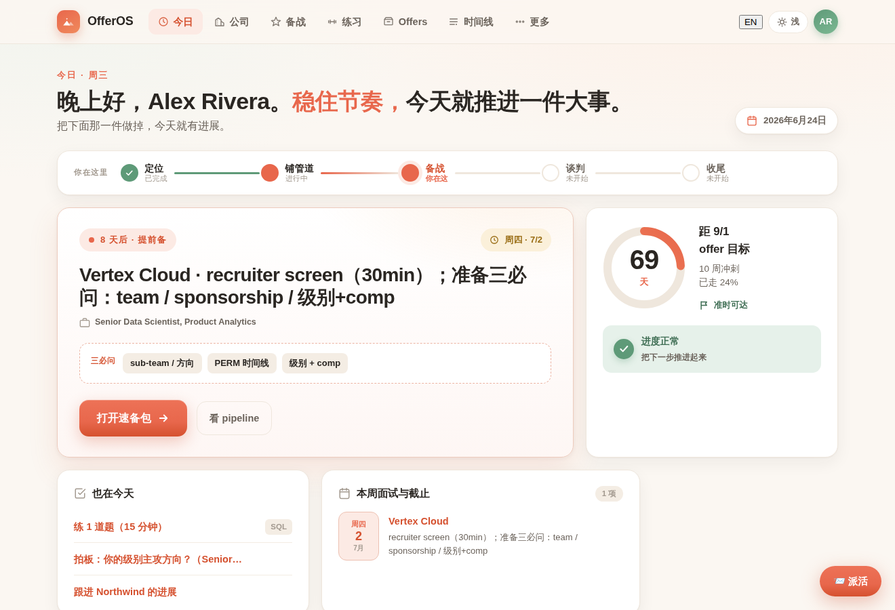
  <br>
  <sub><b>「今日」bento 首页</b>：阶段轨 · 唯一下一步 · offer 倒计时 · 本周面试 · 该你出手了 · 漏斗 —— 图中数据均为<b>虚构样例</b></sub>
</p>

---

## 🚀 快速开始

1. 点 GitHub **「Use this template」** 生成你自己的私有仓库（或用下方一键部署）。
2. 连 **Vercel** 部署，在 **项目 Settings → Environment Variables** 配环境变量：
   - `NEXT_PUBLIC_GITHUB_REPO = <owner>/<repo>`（必配，指向你的仓库；站内编辑 / 派活要用）。
   - `SITE_PASSWORD = <一个密码>`（强烈建议，给全站加**密码门**；不配则全站公开）。
   - 🔒 **密码只在 Vercel 这里设**——它是服务端环境变量，**不走 `/onboard` 向导、也不写进仓库**；以后改密码回 Vercel 改这个变量即可（机制见 [`src/middleware.ts`](src/middleware.ts)）。
3. 打开站点 → **`/onboard` 向导**回答几个问题（**目标角色 DS/DE/SWE/PM/ML** + 名字 + 目标公司），它把模板变成你的、并选好对应角色的备战题库。
   - 或者**把仓库交给 Claude / Codex**，按 **[SETUP.md](SETUP.md)** 引导你装依赖、部署、采访配置（一条龙）。
4. 在 **claude.ai/code** 接上仓库，对 Claude 说「读 CLAUDE.md 和 HANDOFF.md，开始帮我找工作」。

[](https://vercel.com/new/clone?repository-url=https://github.com/genki3ng/OfferOS)
> ☝️ 一键把 OfferOS 部署到你自己的账号：Vercel 会先把本仓库**复制进你的 GitHub**、再部署上线（部署后进站点 **/onboard** 配置成你自己的）。想先要一份可改的仓库，也可以点上面的 **「Use this template」**。

详细步骤 + 之后每天怎么交互 → **[GETTING-STARTED.md](GETTING-STARTED.md)**。

> 📱 **想随时随地用？** 在手机浏览器打开你部署好的站点 → 「加到主屏 / Add to Home Screen」，它会像原生 App 一样全屏启动——边走边查进度、边走边刷题。

---

## ✨ 它能做什么

- **今日**：bento 首页——阶段轨、唯一下一步、倒计时、本周面试、该你出手了、漏斗。
- **跟进雷达**：首页自动算出每家「已投 / 已内推 / 面完」后**沉默了几天**，按 SLA 标 🔴 该催 / 🟡 快到线 / 🟢 还在等——红条直接给下一步动作，别让 offer 因为"忘了催"而凉掉（阈值可调：内推 14 天 · 自投 21 天 · 面后 7 天 · 连接 7 天；天数浏览器实时算、不会过期）。
- **公司 / pipeline**：目标公司库 + 各家进度，状态/内推可直接在站上改。
- **备战 · 自带题库**：**5 套角色题库（DS / DE / SWE / PM / ML），合计约 150 道，每题都配可对照的解法**——光 DS 就有 61 道（SQL 20 · Python 17 含 LeetCode/pandas · 统计与实验 · 产品 sense · 行为面 STAR），不是只给个空壳。配 /practice 练习台抽题练习 + 自评（桌面双栏：左题表 / 右题目+要点，点即换；**编程题（SQL/Python/算法）可先在框里手写解法、点「显示要点」后与参考要点上下对照差异**；**交给 Claude 批改后，它的点评直接挂在题目卡里——可折叠的「📝 点评」框 + 题表里有点评的题标 📝 徽章**；可按**来源/标签**过滤，模板题不带公司标签）；文档/速备包里写到的题号（如 `sql-11`）会自动链到练习台对应题，点一下即开。
- **Offers**：offer 到来时的对比 + 谈判主场（offer 前是预案）。
- **薪资 · Comp**：**levels.fyi 风格**的总包可视化——按级别的 base / 股票 / 奖金堆叠条、各公司样本、你的期望区间，给谈判一个数据锚（数据源 `negotiation/comp-research.md`，站上自动重画）。
- **时间线**：一页看「什么时候该干什么」——待办 + 即将发生（关键日期/截止自动聚合）+ 一路走来（日志），日程与时间线已合并为一页。
- **派活**：在站上 📨 给 Claude 派活 → 写进 `inbox/`，下个 session 自动处理。
- **文档阅读体验**：`/docs` 把全仓 markdown 渲染成清爽文档——居中阅读列、舒适行宽、长段落按句末标点自动断成「一句一行」（两级间距、不糊成一团），`> ` 引用按行首 emoji 自动上色成语义 callout（🔴 风险 / 🟢 已搞定 / 🟡 待办 / 📌 重点），表格斑马纹、任务清单成真·清单——不再是全宽文字墙。
- **卡片/表格不被长文撑爆**：日程与关键日期的事件标题自动摘要成一行事件名（hover 看全文）；岗位库说明、pipeline「下一步」、内推表备注等长内容统一**超行折叠 + 「展开/收起」**——满屏「不换行大段原文」的日子结束了。
- **联网情报**：自带 **Agent‑Reach** + 实测抓取手册——Claude 能直接读 LinkedIn JD、扫各家 ATS 在招岗、用 Exa 全网语义搜公司/人脉情报、拉视频字幕（详见 [tools/web-reach.md](tools/web-reach.md)）。
- **📱 手机友好 · 可安装 (PWA)**：底部 Tab 栏单手操作、长表格自动转卡片、练习台「闪卡」模式——**边走边查、边走边学**；手机浏览器「加到主屏」即像原生 App 一样全屏打开（含 app 图标、主题色、安全区适配）。
- **🌐 中英双语**：整套界面**一键切中 / 英**、cookie 记住你的偏好（默认中文）——中英混合的求职场景顺手，也方便把站点分享给英文搭子 / mentor 看。

Claude 在每一步帮你：打磨/按公司 tailor 简历、出题找薄弱点、设计/解读 A/B 实验、模拟产品评审、把经历整理成 STAR、整理面经反推考点、维护进度、comp 调研与谈判话术、阶段复盘。

---

## 📸 界面一览

> 下面全部用仓库自带的**虚构样例**（候选人 Alex Rivera；公司 Northwind / Vertex Cloud / Helios Media）渲染——部署后用站内 **/onboard** 一键换成你自己的。

<p align="center">
  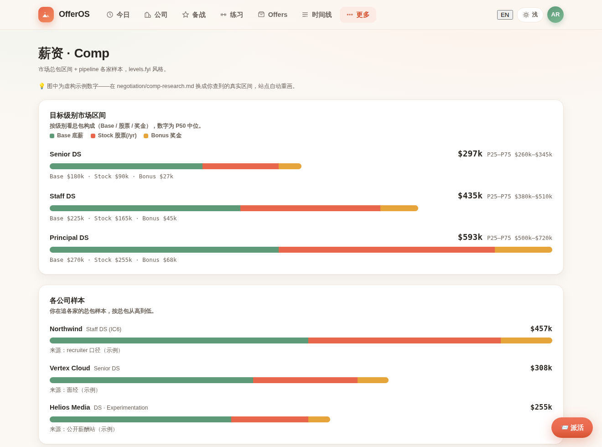
  <br>
  <sub><b>💰 薪资 · Comp（levels.fyi 风格）</b>：按级别的总包堆叠条（Base / 股票 / 奖金，条长随总包等比）+ 各公司样本 + 你的期望区间，给谈判一个数据锚 —— 数据源 <code>negotiation/comp-research.md</code></sub>
</p>

<p align="center">
  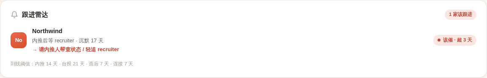
  <br>
  <sub><b>📮 跟进雷达</b>：每家「已投 / 已内推 / 面完」后沉默了几天实时算出来，按 SLA 标 🔴 该催 / 🟡 快到线 / 🟢 还在等，红条直接给动作 —— 数据来自 <code>data/tracker.json</code> 的 <code>lastContact</code> + <code>awaiting</code></sub>
</p>

<p align="center">
  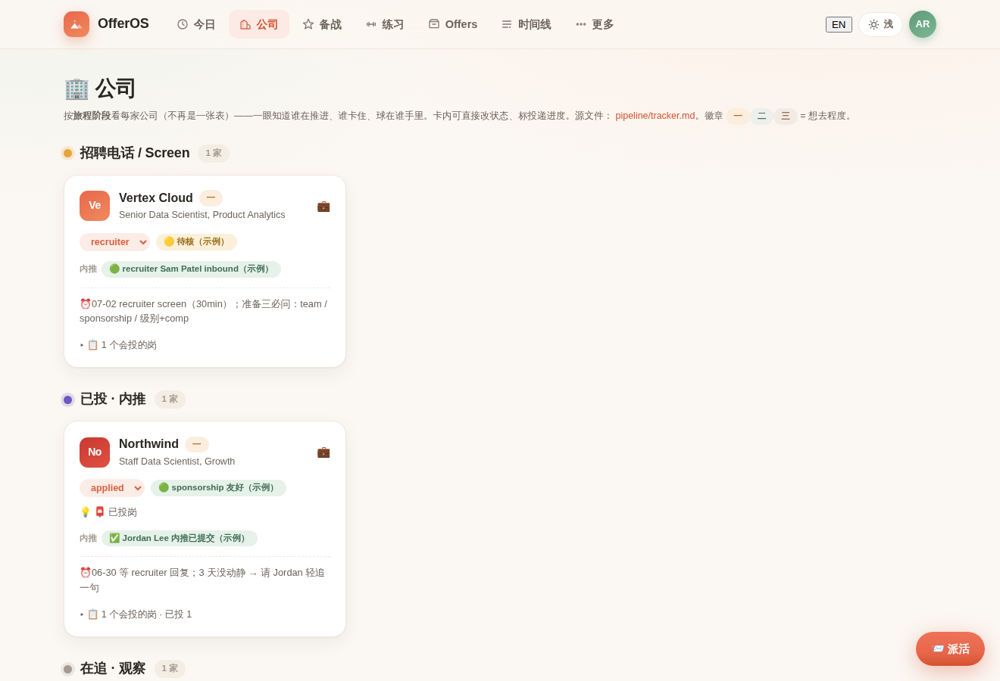
  <br>
  <sub><b>公司 · pipeline</b> — 各家进度一屏看全，状态 / 内推站上直接改</sub>
</p>

<p align="center">
  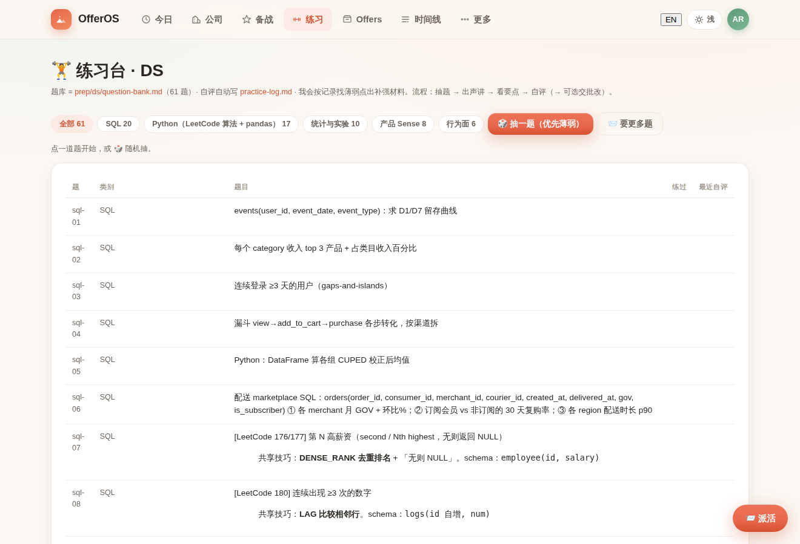
  <br>
  <sub><b>练习台</b> — 自带 5 角色约 150 题（图为 DS 61 题），抽题练习 + 自评，编程题可手写解法对照要点、交批改后点评内联挂在题上</sub>
</p>

<p align="center">
  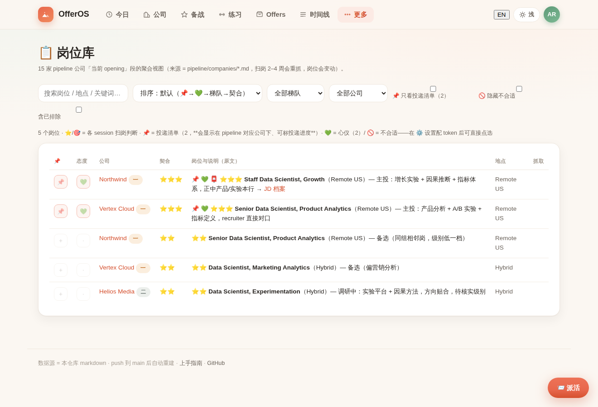
  <br>
  <sub><b>岗位库</b> — 在招岗聚合 + 匹配度 + 优先级星标</sub>
</p>

<p align="center">
  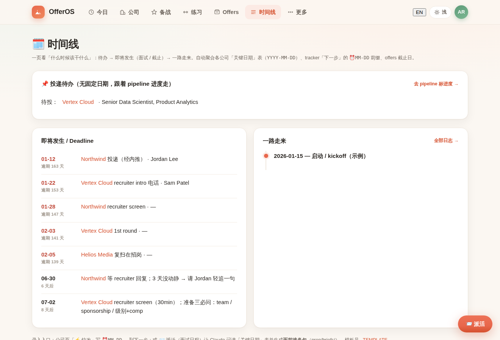
  <br>
  <sub><b>时间线</b> — 待办 + 即将发生（关键日期自动聚合）+ 一路走来</sub>
</p>

<p align="center">
  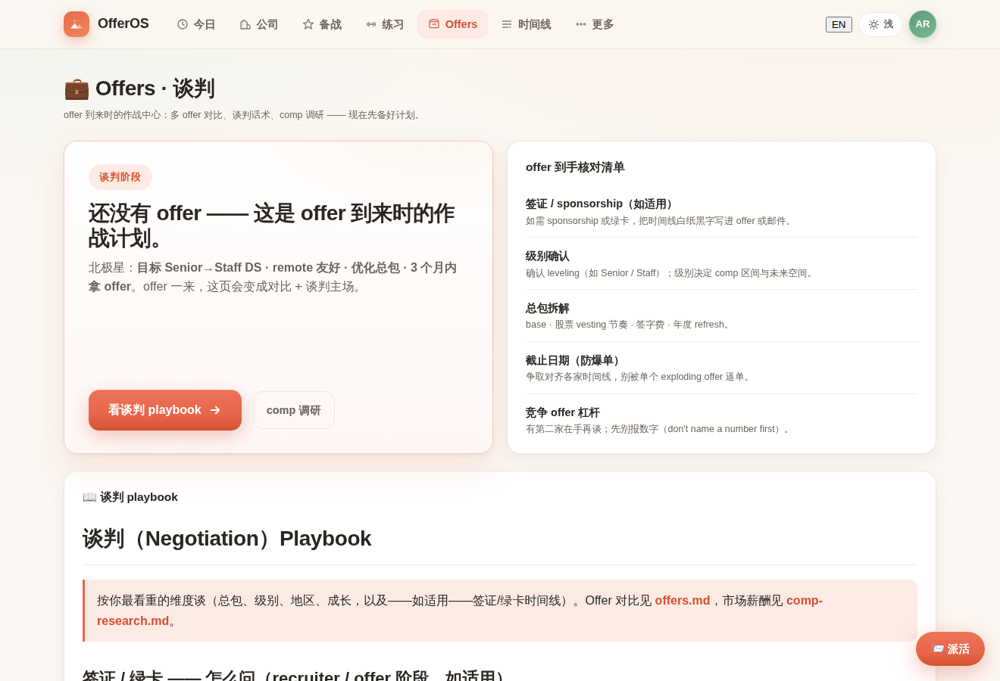
  <br>
  <sub><b>Offers · 谈判</b> — offer 对比 + 谈判主场（offer 前是预案）</sub>
</p>

<p align="center">
  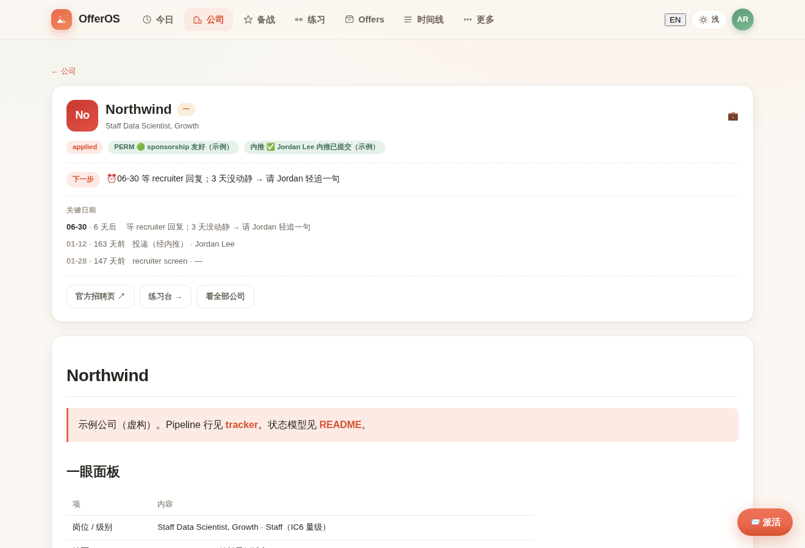
  <br>
  <sub><b>公司详情</b> — 关键日期 / 内推 / 一眼面板 / 面经笔记一页归档</sub>
</p>

<p align="center">
  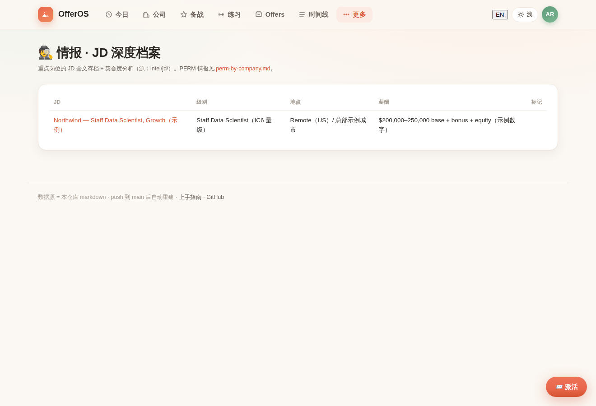
  <br>
  <sub><b>情报 · JD 档案</b> — 重点岗位 JD 全文 + 契合度 + 薪酬带</sub>
</p>

<p align="center">
  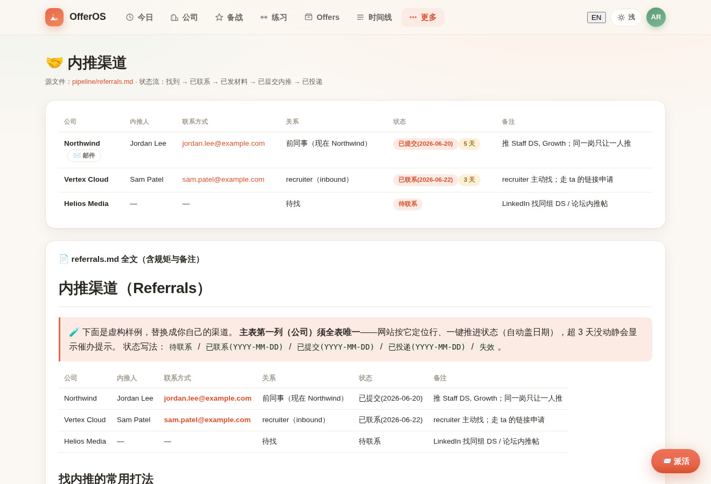
  <br>
  <sub><b>内推渠道</b> — 内推人 / 联系方式 / 状态，邮件一键生成</sub>
</p>

### 🌙 暗色主题 · 🌐 中英双语 · 📱 手机可装 (PWA)

<p align="center">
  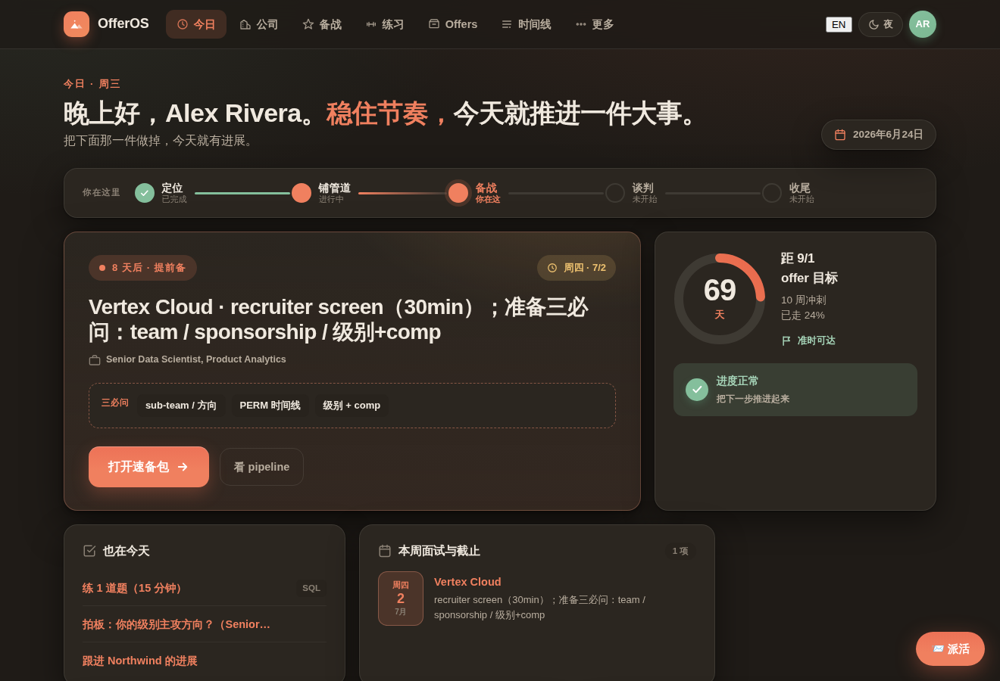
  <br>
  <sub><b>🌙 暗色主题</b> — 同一页，一键切「暖光·浅 / 暖光·夜」</sub>
</p>

<p align="center">
  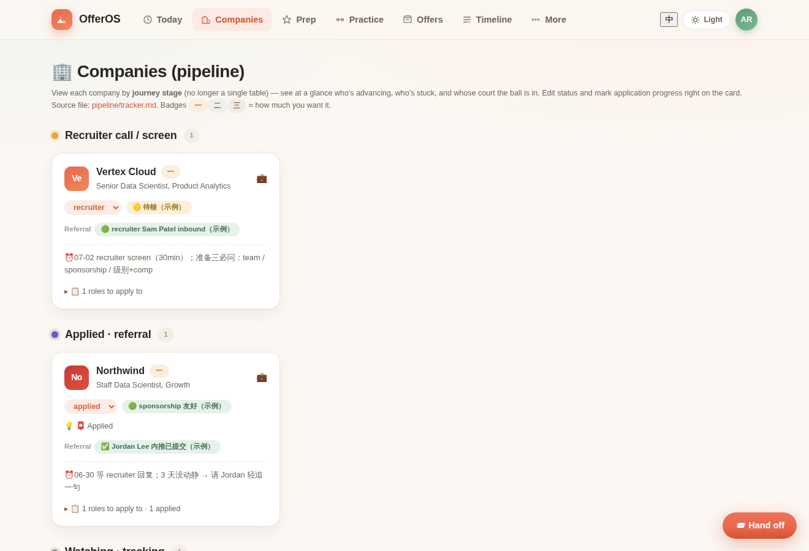
  <br>
  <sub><b>🌐 English</b> — 整套界面一键切中 / 英，cookie 记住偏好</sub>
</p>

<p align="center">
  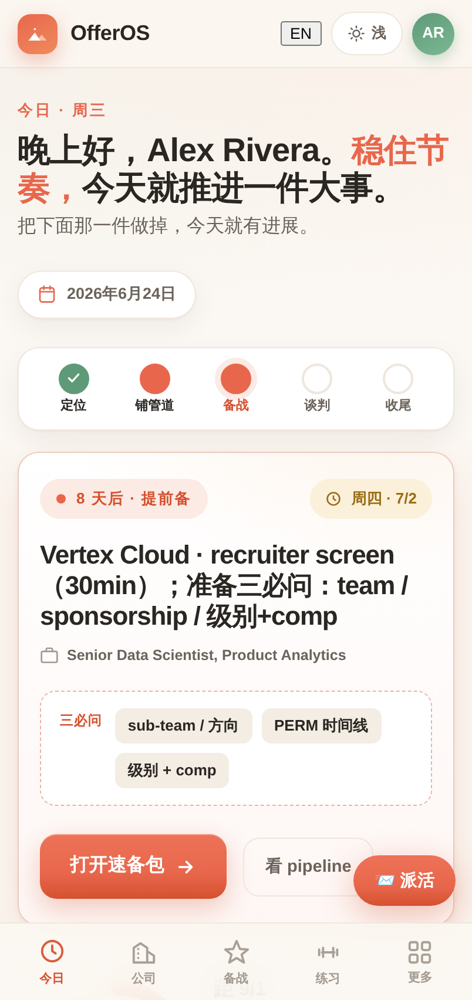
  <br>
  <sub><b>📱 手机 · 今日</b> — 底部 Tab 栏单手操作，「加到主屏」即像原生 App 全屏启动</sub>
</p>

<p align="center">
  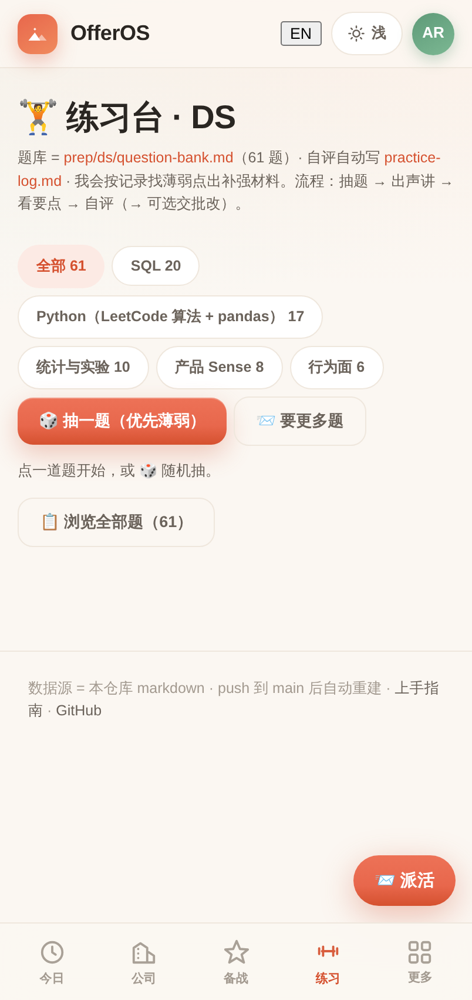
  <br>
  <sub><b>📱 手机 · 练习台</b> — 闪卡模式抽题练习，边走边刷</sub>
</p>

---

## 🧩 OfferOS Suite（套件）

OfferOS 是一组围绕「仓库即数据库」串起来、也可单独取用的组件：

| 组件 | 位置 | 作用 |
|---|---|---|
| **Dashboard 站点** | `src/` | 把全仓 markdown/JSON 渲染成仪表盘（今日 / 公司 / 备战 / Offers / 时间线） |
| **Web Clipper（浏览器扩展）** | [`tools/web-clipper/`](tools/web-clipper/) | 任意网页的面经/JD/截图一键存进 `inbox/`（套件的输入层） |
| **练习台 /practice** | `src/app/practice` | 抽题练习 + 自评（编程题可手写解法对照要点），喂**当前角色**的题库 |
| **内推套件** | `ReferralKit` / `ColdOutreachKit` | 内推邮件生成 + 无内推时的决策流 |
| **inbox 捕获 / 派活 SOP** | [`inbox/`](inbox/) | 捕获与站上「📨 派活」的处理约定 |
| **多角色备战 packs** | [`prep/<role>/`](prep/) | DS / DE / SWE / PM / ML 各一套（题库 + 冲刺 + 板块） |
| **联网情报（Agent‑Reach + 抓取手册）** | [`tools/agent-reach/`](tools/agent-reach/) · [`tools/web-reach.md`](tools/web-reach.md) · `config/mcporter.json` | 一条命令给 Claude/Codex 装上互联网能力：读 LinkedIn 职位、打 Workday/Greenhouse/Ashby 等 ATS API、Exa 全网语义搜索（免 key）、抓 YouTube/B 站字幕 |
| **AI 编排契约** | `CLAUDE.md` / `AGENTS.md` / `SETUP.md` / `.claude/` 钩子 | 交给 Claude/Codex 即可引导部署与日常协作 |
| **中英双语 i18n** | [`src/i18n/`](src/i18n/) | 整站 UI 一键切 zh / en、cookie 记忆（默认中文） |

> 角色由 `data/profile.json` 的 `role` 决定（`/onboard` 向导写入），定义见 [`src/config/roles.ts`](src/config/roles.ts)。

> 🛰️ **差异化优势 · 自带联网情报**：多数「求职模板」只是静态看板。OfferOS 内置了一份**打过补丁、可直接用的 [Agent‑Reach](tools/agent-reach/) 快照** + 一页**实测过的[抓取通路手册](tools/web-reach.md)**。在 claude.ai/code 云端会话里 `bash tools/agent-reach/setup.sh` 一条命令，Claude / Codex 就能**真正联网**——抓 JD 正文与薪资带、扫各家 ATS 的在招岗、用 Exa 做公司/人脉语义搜索、拉视频字幕——把"看板"升级成会**主动找情报**的助手，能力远强于普通 agent。

---

## 🧭 目录导航

| 区 | 动作 | 内容 |
|---|---|---|
| [profile/](profile/) | 定位 | [候选人背景](profile/candidate-profile.md) · [北极星](profile/target.md) · [简历](profile/resume/) |
| [strategy/](strategy/) | 计划 | 总策略 · 目标公司 · 时间线 |
| [prep/](prep/) | 准备 | 多角色 packs：DS / DE / SWE / PM / ML —— 各含题库 + 冲刺 + 板块（见 [prep/](prep/)） |
| [pipeline/](pipeline/) | 记录 | [tracker（data/tracker.json）](data/tracker.json) · [各公司](pipeline/companies/) · [内推](pipeline/referrals.md) |
| [negotiation/](negotiation/) | 谈判 | playbook · offer 对比 · comp 调研 |
| [log/](log/) · [summary/](summary/) | 记录/总结 | 流水日志 · 复盘 |

> 协作约定见 [CLAUDE.md](CLAUDE.md)；网站与数据格式契约见 [STYLEGUIDE.md](STYLEGUIDE.md)。

---

## 🛠️ 技术 & 本地开发

Next.js 15（App Router）+ React 19，零数据库（markdown 即数据源），内置中英 i18n（cookie 切换）、可安装 PWA。

```bash
npm install
npm run dev      # http://localhost:3000
npm run build    # 部署前自检（Vercel 同款构建）
```

可选环境变量：`SITE_PASSWORD`（密码门）、`NEXT_PUBLIC_OWNER_NAME` / `NEXT_PUBLIC_OWNER_INITIALS` / `NEXT_PUBLIC_NORTH_STAR` / `NEXT_PUBLIC_GITHUB_REPO`（覆盖 `src/site.config.ts` 的默认值，不改代码也能个性化）；`NEXT_PUBLIC_DEFAULT_LOCALE=en` 让某个部署默认英文（默认中文）。

---

## 🗒️ 版本 · v0.3

当前 **v0.3**（站点页脚也会显示）。完整变更见 **[CHANGELOG.md](CHANGELOG.md)**。

- **v0.3**：练习台交批改后**点评内联挂在题目卡**（可折叠「📝 点评」框 + 题表 📝 徽章）、编程题**自由 coding 框**先手写再对照要点；今日卡 / 时间线显示面试**具体时间**；修文本选中在深色框看不清；题库「题面必须具体可作答」契约 + 去标识化铁律细化。
- **v0.2**：修文档 frontmatter 标题渲染（不再把 `---…---` 当大标题）、时间线「逾期 / 待投」判定逻辑（历史里程碑不再误判逾期、投递待办按 tracker 真实阶段分组）；页脚版本号 + 本「保持更新」指南。
- **v0.1**：首个公开版——5 套角色题库（DS / DE / SWE / PM / ML，约 150 题带解法）+ /practice、手机 PWA、中英双语、`/onboard` 向导、`/comp` 薪资页、Web Clipper、联网情报（Agent‑Reach）。

### 🔄 保持更新（跟进上游升级）

你用 **「Use this template」/ Fork** 起步——你的仓库从此和上游各走各的。OfferOS 还在迭代，想把上游的修复 / 新功能拉到你已 clone 的仓库：

**① 一次性：加一个 `upstream` 远端**

```bash
git remote add upstream https://github.com/genki3ng/OfferOS.git
```

**② 之后每次想升级：**

```bash
git fetch upstream
git log --oneline HEAD..upstream/main   # 看上游多了啥（或直接读 CHANGELOG.md）
git merge upstream/main                  # 或只挑想要的：git cherry-pick <提交号>
npm install && npm run build             # 自检后再 push
```

**为什么一般不冲突**：升级几乎只动 `src/`（站点代码）；**你的数据在 `*.md` / `data/*.json` / `data/profile.json` / `src/site.config.ts`**，上游样例不碰它们。万一冲突，基本就在这些配置 / 数据文件——保留你的即可。

**怎么知道有没有新版**：站点**页脚显示你当前版本**（如 `OfferOS v0.3`，点开 = [CHANGELOG](CHANGELOG.md)）；或在 GitHub 上 **Watch → Custom → Releases** 订阅。

> 不想合并代码？也可以**只读 [CHANGELOG](CHANGELOG.md)**、把想要的那条改动手动抄进自己的仓库——对你的数据零风险。这是最省心的「优雅」做法。

欢迎试用与反馈（Issue / PR）。

> MIT License。这是个**模板**——fork 去改成你自己的，别把私人求职数据提交回公共仓库。
